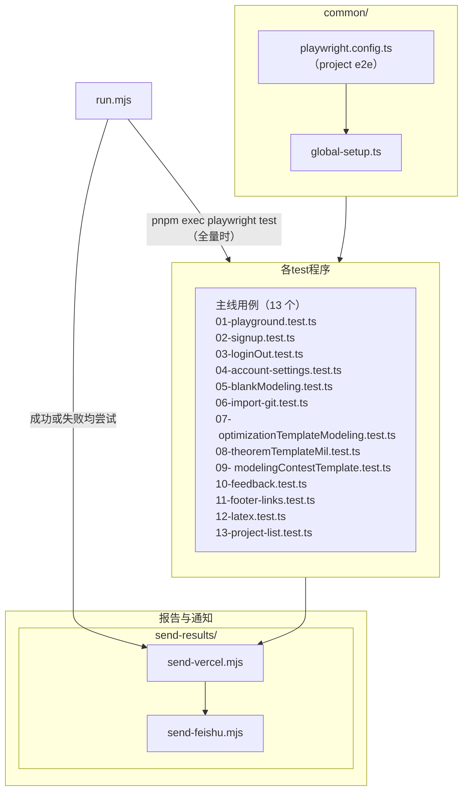

# 测试程序

## 运行环境

- **被测站点**：Playwright 实际访问的 **`baseURL`** 与 global setup 中的跳转同源，由 **`common/global-setup.ts`** 内常量 **`E2E_BASE_URL`** 决定（仓库默认 **`https://beta.reaslab.io`**）；须对 runner **公网可达**（托管机无法直接访问本机 **`localhost`**，除非隧道或 self-hosted）。进程环境里的 **`E2E_BASE_URL`** 若单独设置，主要用于飞书卡片「被测网站」文案（**`send-results/send-feishu.mjs`**），**不会**自动改写 Playwright 访问地址；改指向其它环境时需编辑 **`global-setup.ts`** 并与 **Cloudflare / WAF** 策略（如 **`E2E_WAF_BYPASS_CONTEXT`**、**`x-testing-auth`**）对齐。
- **本机**：在仓库根 **`reaslab-test`** 下 **`pnpm install`** / **`pnpm run …`**。与 CI 对齐的栈为 **Node 20**、**pnpm 9**、**Playwright Chromium**（具体以 **`package.json`** 与 **`.github/workflows/hourly-report-vercel-feishu.yml`** 为准）。**Linux 且 uid=0** 时为 Chromium 附加 **`--no-sandbox`**，避免白屏或登录页元素不出现（**`common/playwright.config.ts`**、**`global-setup.ts`**）。
- **GitHub Actions**：**`runs-on: ubuntu-latest`** 的 **GitHub 托管 runner**（非 self-hosted），job 超时 **`timeout-minutes: 60`**；Playwright 浏览器通过 **cache** 或 **`pnpm install` 的 postinstall**（**`playwright install chromium`**）准备。步骤级细节见下文 **「GitHub Actions 定时任务」**。

## 频次

- **定时**：workflow **`.github/workflows/hourly-report-vercel-feishu.yml`** 使用 **`on.schedule`**，cron **`0 */2 * * *`（UTC，每 2 小时整点：0、2、4… 时的 `:00`）**；换算本地时间见该文件顶部注释。定时任务执行 **`pnpm run reaslab-test -- --exit-zero-on-e2e-failure`**，实际跑哪些用例由 **`common/run-scope.txt`**（章节号列表）经 **`run.mjs`** 解析为 **`test/NN-*.test.ts`**。
- **手动**：同一 workflow 支持 **`workflow_dispatch`**，在仓库 **Actions** 页 **Run workflow** 触发，频次不限。
- **本地 / 其它流水线**：无仓库级固定调度；按需执行 **`pnpm run reaslab-test`**（默认按 **`common/run-scope.txt`** 子集）、**`test:NN`**（单文件）等，见 **`README.md`**。

## 流程（端到端）

1. **准备**：**`pnpm install`**（含浏览器依赖）；需要时配置 **Secrets**（如 **`VERCEL_TOKEN`**）、被测站与 WAF 相关变量（见下文 **Cloudflare**、**GitHub Actions** 各节）。
2. **Global setup（一次）**：**`common/playwright.config.ts`** 的 **`globalSetup`** → **`common/global-setup.ts`**：注入 WAF 绕过头、完成 **GitHub / ReasLab** 等登录，写入 **`common/.auth/storage-state.json`**（**gitignore**），供主线用例 **`storageState`**。
3. **执行用例**：**`pnpm exec playwright test --config common/playwright.config.ts`**，或由 **`pnpm run reaslab-test`** / **`node run.mjs`**（可带 **`--scope-file`**、**`--e2e=…`**）封装；用例在 **`test/**/*.test.ts`**，编号与 **`docs/用户场景.md`** 一致。
4. **报告与通知（走 `run.mjs` 的脚本）**：Playwright 生成 **`playwright-report/`**、**`test-results/`** → **`send-results/send-vercel.mjs`** 部署 HTML 报告 → **`send-results/send-feishu.mjs`** 飞书卡片；**用例失败仍会尽量上传报告并通知**，便于看红用例详情。
5. **退出语义**：默认 **`run.mjs`** 在 E2E / Vercel / 飞书任一步失败时可 **非 0** 退出；**`*:report`** 传入 **`--exit-zero-on-e2e-failure`** 时进程 **固定 0 退出**（定时 job 不把调度标红），**功能成败以报告内各 `test` 绿/红为准**（见下文 **「定时报告：两层语义」**）。

---

## 架构

1. **`common/`**：**`playwright.config.ts`**（`testDir` 为仓库根、`project` 名为 **`e2e`**、`testMatch` 为 **`test/**/*.test.ts`**）、**`global-setup.ts`**（**`E2E_BASE_URL`**、WAF 绕过头、登录 GitHub/ReasLab 等）、以及 **`common/.auth/storage-state.json`**（由 global setup 写入，**gitignore**，供主线用例 `storageState`）。
2. **`test/`**：主线用例（与 **`docs/用户场景.md`** 章节对应）共 **13** 个文件：**`01-playground.test.ts`**、**`02-signup.test.ts`**、**`03-loginOut.test.ts`**、**`04-account-settings.test.ts`**、**`05-blankModeling.test.ts`**、**`06-import-git.test.ts`**、**`07-optimizationTemplateModeling.test.ts`**、**`08-theoremTemplateMil.test.ts`**、**`09-modelingContestTemplate.test.ts`**、**`10-feedback.test.ts`**、**`11-footer-links.test.ts`**、**`12-latex.test.ts`**、**`13-project-list.test.ts`**；另有共享步骤 **`helpers.ts`**、静态夹具 **`test/data/test_upload.png`**、**`test/data/test_upload.tex`** 等。
3. **`test/data/`**：各 **`e2e-*-artifact.ts`** 模块（读写 **`.e2e-artifacts/*.txt`** 中的项目 UUID 等缓存，与 **`test-results/`** 分离以免被 Playwright 清空）。
4. **`send-results/`**：**`send-vercel.mjs`**（部署 **`playwright-report`**）、**`send-feishu.mjs`**（飞书卡片与报告链接）。
5. **`run.mjs`** + **`package.json`**：完整链路主入口 **`pnpm run reaslab-test`** 默认 **`--scope-file=common/run-scope.txt`**。失败仍尝试上传报告并通知飞书；默认 **退出码** 反映测试是否通过。GitHub **定时** job 使用 **`pnpm run reaslab-test -- --exit-zero-on-e2e-failure`**（与 **`reaslab-test`** 相同 scope，追加 **`--exit-zero-on-e2e-failure`**）：跑哪些文件由 **`common/run-scope.txt`**（章节号列表）决定；**调度层始终以 0 退出**（Actions 不标红）；**功能层**各 Playwright 用例可有绿/红，结果写在 **`playwright-report`** / **`test-results/`**，Vercel 成功时飞书带报告链接，失败用例亦在报告内可见。

**下图**为**自上而下**的阅读顺序（与上文「流程」一致，细化到目录与文件）：入口 → 配置与用例 → **`test/`（E2E / Playwright 执行）** → 产出与通知。

**说明**：图为示意，未画 **`test/data/`**（含 **`.e2e-artifacts/`**）、**`node_modules/`**、**`docs/`**、**`.github/workflows/`** 等。**`docs/用户场景.md`** 为用例文案与编号依据；**`CFG --> GS`** 仅为竖排。**`run.mjs`** 在无 scope 子集时经 **`pnpm exec playwright test --config common/playwright.config.ts`** 跑 **`testMatch`** 全量，再 **`send-results/`**；**`playwright-report/`**、**`test-results/`** 与浏览器断言由 Playwright 写盘，图中不展开。**SCENES** 列 **13** 条主线（**`helpers.ts`** 未入框）。顺序由 **`testMatch`** 与命令行决定；增删或重命名主线文件时请同步改 **SCENES**。**`init`** 中 **`useMaxWidth: false`**，**SCENES** 配 **`min-width`**、**`text-align:left`**；**`07-…`**、**`09-…`** 行在连字符后插入 **`\u00A0`**（图中为不换行空格字符），减轻窄布局下的不当断行。

---

本文汇总 **E2E 访问被测环境时的人机 / WAF 绕过**、**GitHub Actions 定时任务（当前为 GitHub 托管 runner）**，以及 **Vercel / Secrets** 的配置要点。

---

## Cloudflare 人机验证与 E2E

**Cloudflare Access + 服务令牌**：Cloudflare **认请求头里的 Id/Secret**（**不依赖**单台 runner IP 固定）。

本仓库当前实现：`common/global-setup.ts` 与 `common/playwright.config.ts` 通过 **`E2E_WAF_BYPASS_CONTEXT`** 为 Playwright 注入 **`extraHTTPHeaders`**（请求头 **`x-testing-auth`**，值在 `global-setup.ts` 中与 **beta.reaslab.io** 上 Cloudflare Access 策略对齐）及固定 **`User-Agent`**。登录与跑测共用该上下文，使访问 **`E2E_BASE_URL`** 时不被人机页拦截。

### 在 GitHub 配置 `VERCEL_TOKEN`（报告部署到 Vercel）

定时 workflow（[`.github/workflows/hourly-report-vercel-feishu.yml`](../.github/workflows/hourly-report-vercel-feishu.yml)）在跑完 E2E 后会执行 `send-vercel.mjs`，依赖环境变量 **`VERCEL_TOKEN`** 调用 Vercel CLI；**勿**把 token 写进仓库代码。

1. **在 Vercel 创建 Token**：登录 [Vercel](https://vercel.com) → 头像 **Account Settings**（或目标 **Team** 设置）→ **Tokens** → 新建 token，生成后**立即复制**（只显示一次）。按公司规范选择个人号或 Team、以及 token 作用域。
2. **在 GitHub 仓库写入 Secret**：打开该仓库 **Settings** → 左侧 **Secrets and variables** → **Actions** → **Secrets** 标签页 → **Repository secrets** 区域点 **New repository secret**。
3. **Name** 填写 **`VERCEL_TOKEN`**（须与 workflow 中 `${{ secrets.VERCEL_TOKEN }}` 名称一致），**Secret** 粘贴 Vercel 上复制的整串 token → **Add secret**。若已存在同名 secret，用右侧 **编辑** 更新即可。
4. 多个仓库共用同一 token 时，也可在 **Organization** → **Settings** → **Secrets and variables** → **Actions** 下创建 **Organization secret**，名称仍用 **`VERCEL_TOKEN`**，并在策略里限定可访问的仓库。

保存后无需改 workflow；下一次 Actions 运行时会自动把 `VERCEL_TOKEN` 注入到部署步骤的 `env` 中。

---

## GitHub Actions 定时任务（`hourly-report-vercel-feishu.yml`）

对应文件：[`.github/workflows/hourly-report-vercel-feishu.yml`](../.github/workflows/hourly-report-vercel-feishu.yml)。

### 触发与并发

- **定时**：`on.schedule`，cron **`0 */2 * * *`**（**UTC**，每 2 小时整点：0、2、4… 时的 `:00`）。换算本地时间请看 workflow 文件顶部注释。
- **手动**：`workflow_dispatch`，可在 Actions 页 **Run workflow**。
- **并发**：`concurrency.group: report-vercel-feishu-scheduled`，`cancel-in-progress: true`——新一次触发会取消仍在跑的上一实例；若不希望被取消，可改为 `false` 或再调稀 cron。

### 执行环境（当前：GitHub 托管，非 self-hosted）

- **`runs-on: ubuntu-latest`**：任务在 **GitHub 提供的 Linux runner** 上执行（工作目录形如 `/home/runner/work/...`），**不是**本机 self-hosted。
- **`timeout-minutes: 60`**：整 job 超时上限。
- **被测地址**：`E2E_BASE_URL` 见 `common/global-setup.ts`，须为 **公网可达**（例如 **`https://beta.reaslab.io`**）。托管 runner **访问不到**你笔记本上的 **`localhost`**，除非另行做隧道或在同一网络自建 runner。

### 步骤概要

1. **`actions/checkout@v4`**：`fetch-depth: 1` 浅克隆。
2. **`pnpm/action-setup@v4`**：pnpm **9**。
3. **`actions/setup-node@v4`**：Node **20**（未启用 `cache: pnpm`，与 workflow 注释一致）。
4. **Detect local Playwright browser cache**：检查 `~/.cache/ms-playwright` 是否已有 `chromium-*`。在 **GitHub 托管** 机上通常为「无」，下一步会走缓存恢复。
5. **Restore Playwright browsers (`actions/cache@v4`)**：缓存路径 `~/.cache/ms-playwright`，key 与 `pnpm-lock.yaml` 哈希绑定；未命中时依赖 **`pnpm install` 的 postinstall**（`playwright install chromium`）从 Playwright CDN 下载。
6. **`pnpm install --frozen-lockfile`**：`env CI: "true"`。
7. **Run scoped E2E (common/run-scope.txt), deploy Vercel, notify Feishu**：**`pnpm run reaslab-test -- --exit-zero-on-e2e-failure`**（**`run.mjs`** 按 **`common/run-scope.txt`** 解析章节号 → 仅跑对应 **`test/NN-*.test.ts`** → Vercel 部署 `playwright-report` → 飞书；见上 **`--exit-zero-on-e2e-failure`**）；`env` 注入 **`VERCEL_TOKEN: ${{ secrets.VERCEL_TOKEN }}`**。改跑哪些文件：编辑 **`common/run-scope.txt`**，或在该 step 的 `env` 设 **`E2E_SCOPE_FILE`** 指向其它列表文件。

### 定时报告：两层语义（调度 vs 功能）

1. **调度层**（**`reaslab-test` + GitHub Actions**）：传入 **`--exit-zero-on-e2e-failure`**（例如定时 job 的 **`pnpm run reaslab-test -- --exit-zero-on-e2e-failure`**）时 **`run.mjs` 固定以 0 退出**，避免因单次 E2E、Vercel 或飞书脚本非 0 而把整次定时任务标红。  
2. **功能层**（**Playwright**）：每条 **`test(…)`** 可 **通过（绿）** 或 **失败（红）**——即常说的 **「红用例」**：断言未满足、超时或浏览器步骤失败等；**绿/红都会写入同一份 HTML 报告**（及 JSON 等），Vercel 部署成功时飞书可带 **「打开报告」** 链接，测试者从报告里查看哪些功能点过、哪些没过。

### Secrets 与托管 runner

- **`secrets.*`** 由 GitHub 注入到该次 job 进程环境，**不会**作为明文写入仓库；日志中敏感项通常会被 **mask**。
- 托管 runner 为**一次性虚拟机环境**，无「同机多用户偷看进程环境」问题，但仍需遵循公司规范：**勿在 fork 的 PR workflow 中把 secrets 暴露给不可信贡献者**（本定时 workflow 仅在默认分支配置下由仓库维护者管理即可）。

### 定时与时区

`schedule` 的 cron **一律为 UTC**。换算见 workflow 文件顶部注释。

### 相关官方文档

- [Workflow syntax for GitHub Actions](https://docs.github.com/en/actions/using-workflows/workflow-syntax-for-github-actions)（`on.schedule`、`runs-on`、`concurrency` 等）
